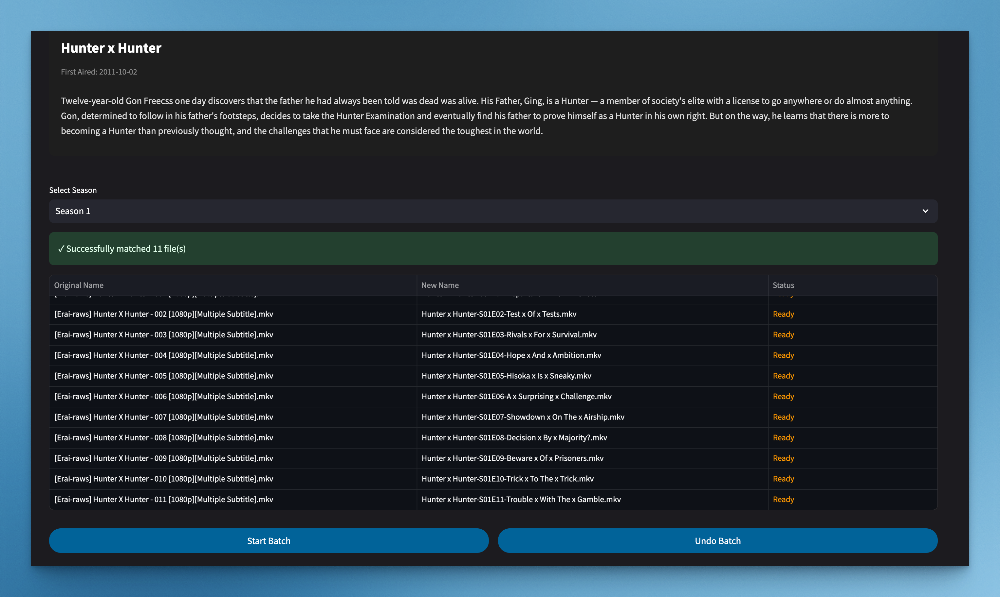

# TV Show Renamer Web App 🎬

A modern, streamlined web application for renaming TV show files using TMDB data. Built with Streamlit for simplicity and ease of use.

## Core Philosophy 🎯

- **Simplicity First**: Clear, focused functionality with minimal complexity
- **User-Centric Design**: Intuitive interface leveraging Streamlit components
- **Efficient Workflow**: Fast, reliable file operations with clear feedback

## Features ✨

| Feature | Description |
|---------|-------------|
| 🔍 Smart Detection | Automatic show and episode matching |
| 📁 Flexible Input | Upload files directly through the app |
| 🎬 TMDB Integration | Accurate episode data from TMDB API |
| ⚡ Batch Processing | Efficient multi-file renaming |
| 📱 Responsive | Adapts to all screen sizes |
| 🎥 Format Support | Works with mkv, mp4, avi, mov, wmv |

## Quick Start 🚀

1. **Setup Environment**
```bash
# Clone repository
git clone https://github.com/reneboygarcia/renamer-web-app.git
cd renamer-web-app

# Install dependencies
make install
```
2. **Activate Virtual Environment**
```bash
# Activate virtual environment
source venv/bin/activate
```
3. **Configure API**
```bash
make setup-env
```

4. **Run Application**
```bash
make run
```

## Development Guide 🛠️

### Prerequisites
- Python 3.8+
- TMDB API key

### Setup Development Environment
```bash
# Install development dependencies
make install-dev

# Code quality checks
make lint
```

### Clean Code Practices
- Single responsibility per module
- Comprehensive test coverage
- Clear documentation
- Consistent code style (Black + Pylint)

## Project Structure 📁

```
renamer-web-app/
├── src/               # Source code
│   ├── app.py        # Main application
│   ├── core/         # Core business logic
│   └── utils/        # Utility functions
├── requirements.txt  # Dependencies
```

Note: To lift the 200MB file size limitation for Streamlit's file uploader to 2GB, add the following to your `.streamlit/config.toml` file:

```toml
[server]
maxUploadSize = 2000
```

For more configuration options, refer to the [Streamlit configuration documentation](https://docs.streamlit.io/develop/api-reference/configuration/config.toml).
